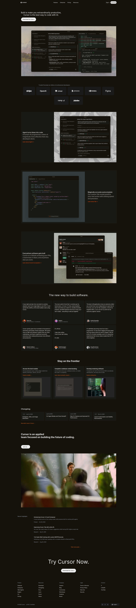

# Dev-Tool-Landing-Page - Cursor HTML

A recreation of the [Cursor](https://cursor.sh) landing page using HTML and CSS.



## Sections Recreated

1. **Header** - Fixed navigation bar with logo, nav links (Features, Enterprise, Pricing, Resources), and Sign In/Download buttons
2. **Hero Section** - Main headline with download CTA and UI screenshot
3. **Trusted By** - Logo grid showcasing companies (Stripe, OpenAI, Linear, Datadog, Nvidia, Figma, Ramp, Adobe)
4. **UI Showcase** - Three product UI images
5. **Testimonials** - 6-card grid featuring quotes from Diana Hu, shadcn, Andrej Karpathy, Patrick Collison, ThePrimeagen, and Greg Brockman
6. **Stay on the Frontier** - 3-card feature section (Best Models, Codebase Understanding, Enterprise)
7. **Changelog** - 4-card grid showing recent updates
8. **Team Section** - Company mission statement with team photo
9. **Recent Highlights** - Blog/research post previews
10. **CTA Section** - Final "Try Cursor Now" call-to-action
11. **Footer** - 5-column link grid with theme toggles and language selector

## Fonts

- **Primary Font:** [Inter](https://fonts.google.com/specimen/Inter) (Google Fonts)
- **Weights Used:** 400 (Regular), 500 (Medium), 600 (Semi-bold), 700 (Bold)
- **Fallbacks:** `-apple-system, BlinkMacSystemFont, 'Segoe UI', Roboto, sans-serif`

## Colors

| Color | Hex Code | Usage |
|-------|----------|-------|
| Background | `#14120b` | Main page background |
| Card Background | `#1b1913` | Testimonial, frontier, changelog cards |
| Card Background Alt | `#1a1a1a` | Logo cards, theme toggles, hover states |
| Primary Text | `#EDECEC` | Headings, body text |
| Secondary Text | `#9ca3af` | Subtitles, meta text, nav hover |
| Accent | `#f97316` | Links (orange) |
| Border | `#2a2a2a` | Dividers, borders |
| Border Alt | `#3a3a3a` | Version badges |
| Button Dark | `#333` | Sign in button border |
| Button Hover | `#222` | Sign in button hover |
| Button Light | `#d1d1d1` | Download button hover |

## Project Structure

```
├── index.html      # Main HTML structure
├── styles.css      # All styling
├── README.md       # This file
└── assets/         # Images and icons
    ├── ss.png
    ├── cursor-whiteIcon.svg
    ├── cursor-uiImage.png
    ├── cursor-uiImage2.png
    ├── cursor-uiImage3.png
    ├── cursor-uiImage4.png
    ├── frontier-Image1.png
    ├── frontier-Image2.png
    ├── frontier-Image3.png
    ├── homepage-team-photo.webp
    └── *-avatar.webp (testimonial avatars)
```

## Usage

Simply open `index.html` in a browser. No build tools required.